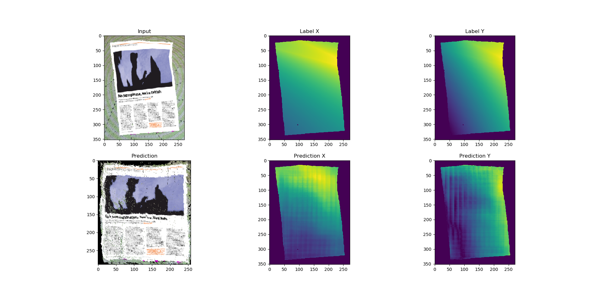
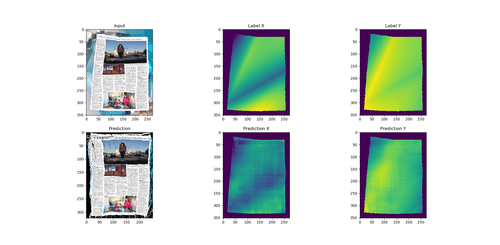
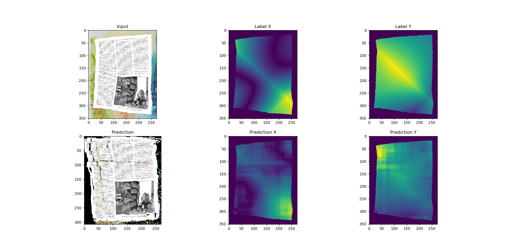

[DocUNet: Document Image Unwarping via A Stacked U-Net](http://www3.cs.stonybrook.edu/~cvl/content/papers/2018/Ma_CVPR18.pdf), Ke Ma, Zhixin Shu, Xue Bai, Jue Wang, Dimitris Samaras. Proceedings of IEEE Conference on Computer Vision and Pattern Recognition (CVPR)

### 数据生成
+ 进入data目录，在config.json中填写配置文件，然后使用命令`ulimit -s`检查用户进程的堆栈软限制大小，Ubuntu默认为8Mb，建议调大，直到不报*段错误*，使用命令`ulimit -s [size]`，需要先调大硬限制
+ 运行文件generate.py开始生成数据

### 图片反变形
+ 导入inverse_deform模块
+ 使用函数`inverse_deform(img_path, label_path, save_path)`即可反变形

### 训练结果

